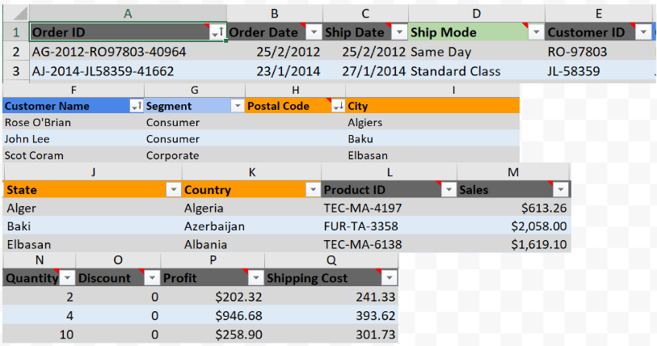
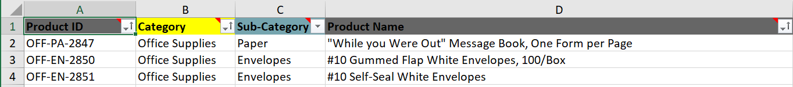
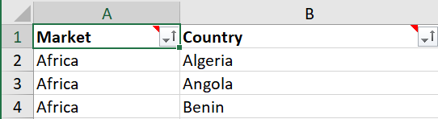
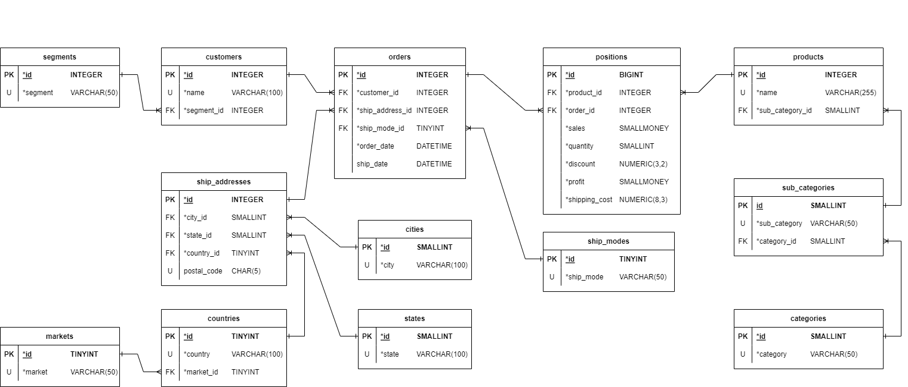

# The final project for the "Data Bases" class

## Subjects
* SQL server
* Relational databases
* Indexes
* ERD diagrams
* procedures 
* functions
* T-SQL
* XML data format

## Tools
* Docker
* Azure database studio

## Based data
* [link to xlsx file](/base_data.xlsx)

## Exercise 1
Create ERD Diagram based on the data.xlsx file. Your model should include types of data, primary keys, foreign keys, NULL or NOT NULL, relationships between tables, and constraints...

