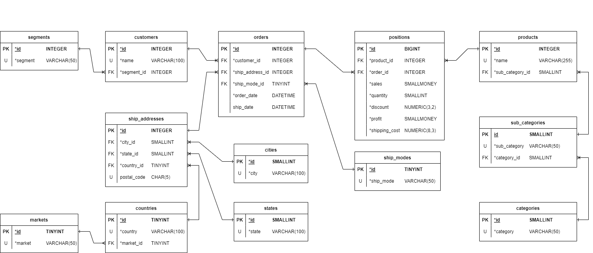

# The final project for the "Data Bases" class

## Subjects
* SQL server
* Relational databases
* Indexes
* ERD diagrams
* procedures 
* functions
* T-SQL
* XML data format

## Tools
* Docker
* Azure database studio

## Based data
* [link to xlsx file](/datasets/base_data.xlsx)

## Exercise 1
Create ERD Diagram based on the data.xlsx file. Your model should include types of data, primary keys, foreign keys, NULL or NOT NULL, relationships between tables, and constraints...

## Exercise 2
Map the ERD diagram you made in the first task.
* Create a database named "OrderDB" using  SQL Server.
* Implement a procedure which allows you to add an order for a random client for more than one product.

[T-SQL code for exercise 2](https://github.com/SzymonKwiecinski/simulation-of-API-for-order-management-/blob/main/exercise_2.sql)

## Exercise 3
* Create cluster and non-cluster indexes. Explain your choice.
* Create sparse and dense indexes. Explain your choice
* Create column-store index
* Create a procedure which returns all orders in the chosen country and with products in chosen category
* Create a procedure which returns two newest orders for clients in segment=Consument

[T-SQL code for exercise 3](https://github.com/SzymonKwiecinski/simulation-of-API-for-order-management-/blob/main/exercise_3.sql)

## Exercise 4
* Create API uding Flask or FastAPI [or micro webside]

## TO DO
[ ] - transalte sql comments to english  
[ ] - minialize pictures with excele  
